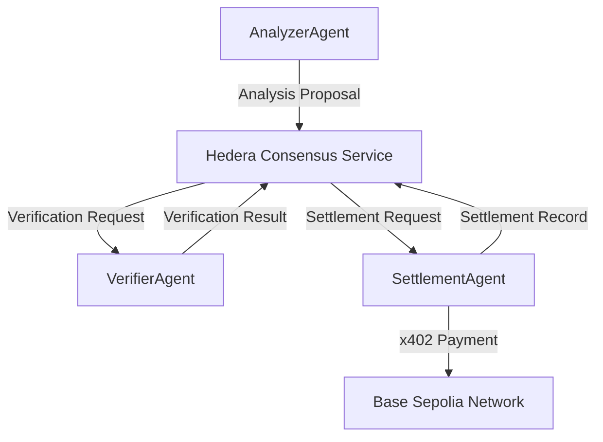

# Hedera A2A Agent System

A sophisticated multi-agent system built on Hedera Hashgraph that enables autonomous agent-to-agent communication and settlement using the x402 payment protocol. This system demonstrates the power of decentralized consensus-based messaging combined with automated payment execution.

## 🚀 Quick Start

```bash
# 1. Clone and install
git clone https://github.com/Hebx/hedera-a2a-agents.git
cd hedera-a2a-agents
npm install

# 2. Setup environment
cp env.example .env
# Edit .env with your Hedera testnet credentials

# 3. Register agents
npx tsx setup/register-agents.ts

# 4. Run the complete demo
npm run demo
```

## 📋 Overview

This project implements a three-agent pipeline that processes transactions autonomously:

```
Account Query → Analysis → Verification → Settlement → Payment Execution
     ↓              ↓           ↓            ↓
AnalyzerAgent → VerifierAgent → SettlementAgent → x402 Payment
```

### 🤖 Agent System

| Agent               | Responsibility                           | Key Features                                                              |
| ------------------- | ---------------------------------------- | ------------------------------------------------------------------------- |
| **AnalyzerAgent**   | Account analysis and proposal generation | • Hedera SDK integration<br>• Mirror Node queries<br>• Threshold analysis |
| **VerifierAgent**   | Business logic validation                | • Proposal validation<br>• Custom message handlers<br>• Approval routing  |
| **SettlementAgent** | Payment execution and recording          | • x402 payment protocol<br>• Multi-chain support<br>• Settlement tracking |

## 🏗️ Architecture

The system uses Hedera Consensus Service (HCS) for agent communication, ensuring immutable and ordered message delivery:



### Key Components

- **HCS-10 Standard**: Agent registration and communication protocol
- **Hedera SDK**: Blockchain interactions and account queries
- **a2a-x402**: Autonomous agent payment protocol
- **Ethers.js**: Ethereum-compatible network interactions

## 🔧 Setup Instructions

### Prerequisites

1. **Hedera Testnet Account**: Get HBAR from [Hedera Portal](https://portal.hedera.com/)
2. **Node.js**: Version 18+ recommended
3. **TypeScript**: For development and testing

### Environment Configuration

1. **Copy environment template**:

   ```bash
   cp env.example .env
   ```

2. **Configure your Hedera credentials**:

   ```bash
   # Required: Your Hedera testnet account
   HEDERA_ACCOUNT_ID=0.0.123456
   HEDERA_PRIVATE_KEY=your_private_key_here

   # Optional: Settlement configuration
   BASE_RPC_URL=https://sepolia.base.org
   SETTLEMENT_WALLET_PRIVATE_KEY=your_wallet_private_key
   USDC_CONTRACT=0x036CbD53842c5426634e7929541eC2318f3dCF7e
   MERCHANT_WALLET_ADDRESS=0x1234567890123456789012345678901234567890
   ```

3. **Register agents**:
   ```bash
   npx tsx setup/register-agents.ts
   ```

This will automatically:

- Create agent accounts on Hedera testnet
- Generate HCS topics for communication
- Save credentials to your `.env` file

## 🧪 Testing

### Individual Agent Tests

```bash
# Test AnalyzerAgent
npm run test:analyzer

# Test VerifierAgent
npm run test:verifier

# Test SettlementAgent
npm run test:settlement
```

### Complete System Demo

```bash
# Run the full workflow demo
npm run demo

# With custom parameters
npm run demo -- 0.0.123456 100
```

## 📚 Agent Documentation

### AnalyzerAgent

Queries Hedera accounts and generates analysis proposals.

```typescript
import { AnalyzerAgent } from "./src/agents/AnalyzerAgent";

const analyzer = new AnalyzerAgent();
await analyzer.init();

// Query account information
const accountInfo = await analyzer.queryAccount("0.0.123456");
console.log(`Balance: ${accountInfo.balance} HBAR`);
```

**Features**:

- Direct Hedera SDK integration
- Mirror Node API fallback
- Threshold-based analysis
- Comprehensive account data

### VerifierAgent

Validates proposals and applies business logic.

```typescript
import { VerifierAgent } from "./src/agents/VerifierAgent";

const verifier = new VerifierAgent();
await verifier.init();

// Register custom message handler
verifier.onMessage("custom_type", (message) => {
  console.log("Custom message received:", message);
});
```

**Features**:

- Proposal validation
- Custom message handlers
- Approval/rejection logic
- HCS message routing

### SettlementAgent

Executes payments and records settlements.

```typescript
import { SettlementAgent } from "./src/agents/SettlementAgent";

const settlement = new SettlementAgent();
await settlement.init();
// Agent automatically listens for verification results
```

**Features**:

- x402 payment protocol
- Multi-chain support (Base Sepolia)
- USDC token payments
- Settlement recording

## 🔄 Message Flow

### 1. Analysis Phase

```json
{
  "type": "analysis_proposal",
  "accountId": "0.0.123456",
  "balance": "100.5 ℏ",
  "threshold": 50,
  "meetsThreshold": true,
  "timestamp": 1703123456789
}
```

### 2. Verification Phase

```json
{
  "type": "verification_result",
  "originalProposal": {
    /* analysis_proposal */
  },
  "approved": true,
  "reasoning": "Proposal approved: meets threshold requirements",
  "timestamp": 1703123456789
}
```

### 3. Settlement Phase

```json
{
  "type": "settlement_complete",
  "txHash": "0x1234567890abcdef...",
  "amount": "10 USDC",
  "timestamp": 1703123456789
}
```

## 🌐 Network Support

### Hedera Hashgraph

- **Network**: Testnet
- **Service**: Hedera Consensus Service (HCS)
- **Standard**: HCS-10 for agent registration
- **Features**: Immutable messaging, consensus ordering

### Ethereum-Compatible Networks

- **Primary**: Base Sepolia
- **Token**: USDC (ERC-20)
- **Protocol**: x402 payment standard
- **Features**: Automated payment execution

## 📊 Monitoring

### HCS Topic Monitoring

- **HashScan**: [https://hashscan.io/testnet/topic/{TOPIC_ID}](https://hashscan.io/testnet)
- **Real-time**: Message tracking and verification
- **History**: Complete message audit trail

### Transaction Monitoring

- **BaseScan**: [https://sepolia.basescan.org](https://sepolia.basescan.org)
- **Payment Tracking**: x402 transaction verification
- **Settlement Confirmation**: Payment completion status

## 🛠️ Development

### Project Structure

```
hedera-a2a-agents/
├── src/agents/           # Agent implementations
│   ├── AnalyzerAgent.ts
│   ├── VerifierAgent.ts
│   └── SettlementAgent.ts
├── setup/               # Agent registration
│   └── register-agents.ts
├── demo/                # System demonstration
│   └── orchestrator.ts
├── test-*.ts           # Individual agent tests
└── docs/               # Documentation
    ├── PRD.md          # Product Requirements
    └── Architecture.md # Technical Architecture
```

### Key Dependencies

- `@hashgraph/sdk` - Hedera blockchain interactions
- `@hashgraphonline/standards-agent-kit` - HCS-10 client
- `a2a-x402` - Autonomous agent payments
- `ethers` - Ethereum/EVM interactions
- `chalk` - Terminal styling
- `dotenv` - Environment management

## 🔒 Security

### Credential Management

- **Environment Variables**: Secure credential storage
- **Private Key Formats**: Support for DER, ED25519, ECDSA
- **Agent Isolation**: Unique credentials per agent
- **Fallback Mechanisms**: Graceful degradation

### Transaction Security

- **Cryptographic Signing**: All operations signed
- **Consensus Verification**: HCS message integrity
- **Payment Validation**: x402 protocol compliance
- **Error Handling**: Comprehensive error recovery

## 🚀 Production Considerations

### Scalability

- **Horizontal Scaling**: Multiple agent instances
- **Load Balancing**: Message distribution
- **Topic Partitioning**: High-volume message handling

### Monitoring

- **Health Checks**: Agent status monitoring
- **Performance Metrics**: Latency and throughput
- **Error Tracking**: Comprehensive logging
- **Alerting**: Critical failure notifications

## 📖 Documentation

- **[Product Requirements Document](PRD.md)** - Complete product specifications
- **[Architecture Document](Architecture.md)** - Technical implementation details
- **[Setup Guide](SETUP.md)** - Detailed setup instructions

## 🤝 Contributing

1. Fork the repository
2. Create a feature branch
3. Make your changes
4. Add tests for new functionality
5. Submit a pull request

## 📄 License

ISC License - see [LICENSE](LICENSE) file for details.

## 🆘 Support

- **Issues**: [GitHub Issues](https://github.com/Hebx/hedera-a2a-agents/issues)
- **Discussions**: [GitHub Discussions](https://github.com/Hebx/hedera-a2a-agents/discussions)
- **Hedera Community**: [Discord](https://discord.gg/hedera)

---

**Built with ❤️ on Hedera Hashgraph**
